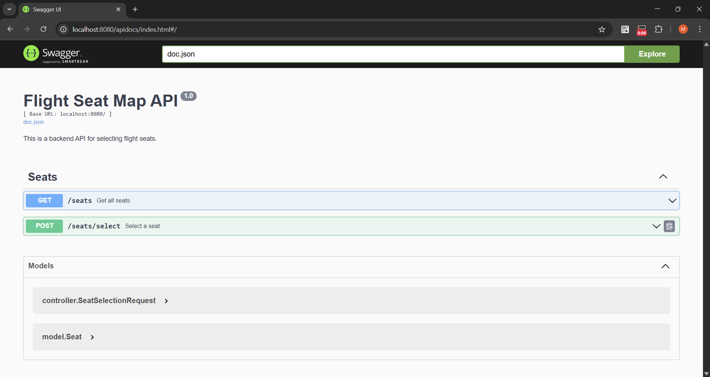
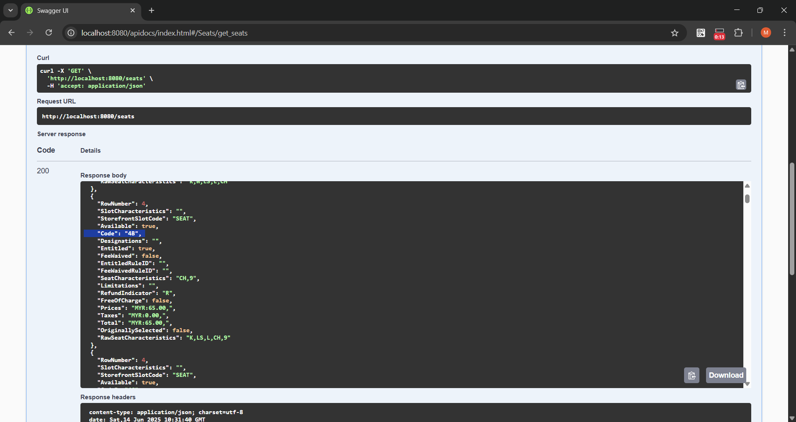
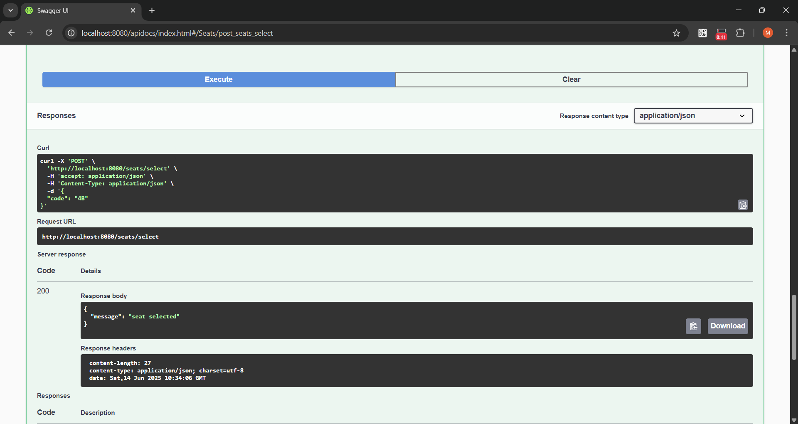
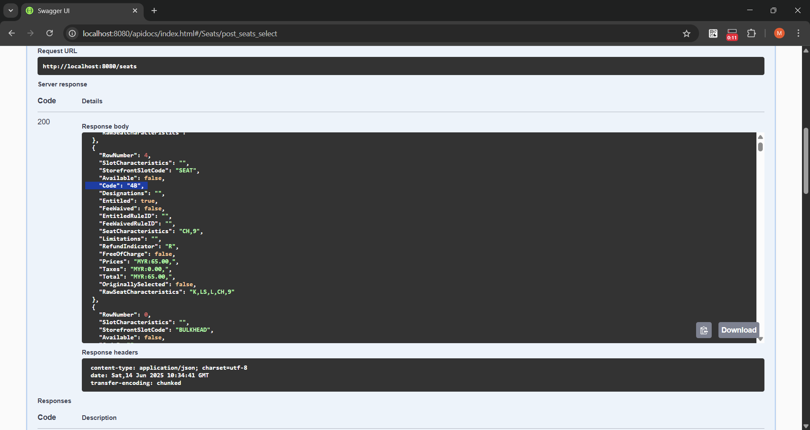

# Flight Seat Map API

A Golang REST API for managing airline seat maps, including seats and slot types (like blanks, aisles, etc). Built using Go, PostgreSQL, GORM, and Gin. Fully Dockerized and Swagger-documented.

## Features

- Auto-imports a JSON seat map on startup
- Supports both seats and non-seat slots (e.g. blank, aisle)
- Inserts or updates on conflicts using composite unique keys
- Uses PostgreSQL with GORM ORM
- Swagger UI at `/apidocs`

## Requirements

To run this project locally or build it in Docker, you’ll need:
- Go 1.20+
- Docker 20.10+
- Docker Compose 1.29+ or Compose v3.8+ compatible (comes with Docker Desktop)
- Git
- Swag CLI
    ```go
    go install github.com/swaggo/swag/cmd/swag@latest
    ```

## Setup

1. Clone the repository
    ```bash
    git clone git@github.com:mghifariyusuf/flight-seatmap-api.git
    cd flight-seatmap-api
    ```

2. Install Dependencies
    ```bash
    go mod tidy
    ```

3. Generate Swagger Docs
    ```bash
    go install github.com/swaggo/swag/cmd/swag@latest
    swag init -g cmd/main.go --output docs
    ```

4. Set in .env file
    ```
    DB_HOST=db
    DB_PORT=5432
    DB_USER=postgres
    DB_PASSWORD=postgres
    DB_NAME=seatmap
    ```

## Run with Docker
```bash
docker-compose up --build
```

This will:
- Start a PostgreSQL container
- Build the Go API
- Database will be cleaned up and import the SeatMapResponse.json
- Serve the API at `http://localhost:8080`

## API Endpoints

| Method | Endpoint        | Description                  |
|--------|-----------------|------------------------------|
| GET    | `/seats`	       | Get all seat and slot data   |
| POST	 | `/seats/select` |	Reserve a seat by code    |

## Swagger Docs

Open in browser: `http://localhost:8080/apidocs/index.html`



## Cleanup

```bash
docker-compose down --volumes
```

## Sample

```bash
curl --location 'http://localhost:8080/seats' \
--header 'Content-Type: application/json'
```

```bash
curl --location 'http://localhost:8080/seats/select' \
--header 'Content-Type: application/json' \
--data '{
    "code": "4B"
}'
```

### Get Seats (Before)

Seat `4B` is available with `true` value



### Post Select Seat

User select seat `4B`, seat selected



### Get Seats (After)

Seat `4B` is unavailable now, with `false` value

